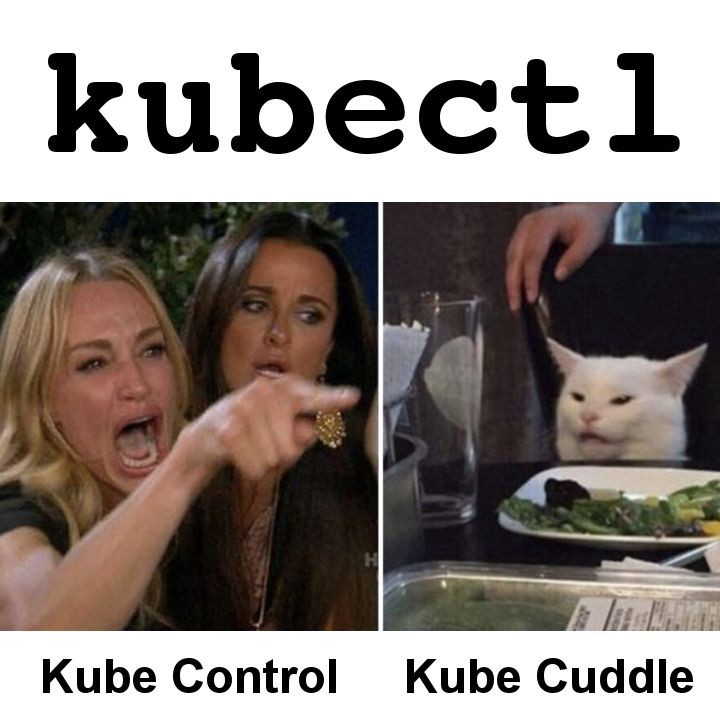

### These command line tricks will help you expedite your Kubernetes tasks 🏃🏻‍♂️💨

The most crucial Kubernetes command-line tool, kubectl, enables you to
execute commands against clusters. Applications may be deployed, cluster
resources can be inspected and managed, and logs can also be seen using
kubectl. You control Kubernetes using Kubectl, which is the primary
command-line tool for Kubernetes. Kubectl is best thought of as SSH for
Kubernetes, which is a useful analogy. It is offered for Windows, Mac,
and Linux.

In general, kubectl transforms simple commands into the JSON payload
needed by the API server. To determine the cluster and API server
endpoint to POST to, it needs a configuration file.

In this article, we're going to go through some quick and easy tips &
tricks that will help saving valuable time and making the most out of
kubectl. If you're still new to Kubernetes, you might want to go through
my previous article which introduces you to k8s concepts etc.

[**Medium**\
*Edit
description*medium.com](https://medium.com/@devangtomar/kubernetes-for-dummies-yes-literally-2734cf1a2291)

#### 1. Make use of aliases 🖇️

Setting up some aliases for running kubectl is really helpful because
Kubernetes commands can be very long. When you wish to run several
Kubernetes commands at once, it will be much simpler because you won't
have to repeat the complete command every time.

Here's how you create aliases on your machine :
<https://phoenixnap.com/kb/linux-alias-command>

Aliases for a few regularly used commands are shown below. To save time,
run these before executing kubectl instructions. Instead of typing
kubectl , you just need to type k :

Want even more of these? Visit this [kubectl-aliases GitHub
repository](https://github.com/ahmetb/kubectl-aliases) which is a true
haven for fans of aliases.

**Note :** Aliases can be dangerous at times, please use wisely.

#### 2. Dry run like a pro 😎

The \--dry-run flag of the kubectl run command (as well as create,
apply, and patch) is a fantastic feature that lets you see the
anticipated changes without actually executing them.

This command outputs the manifest of the needed object when used with -o
yaml.

For instance :

kubectl \--dry-run=client -o yaml run alpine \--image=alpine \>
alpine.yaml

this will produce the following YAML (alpine.yaml) :

Now all you have to do is save it to a file, remove a few system or
superfluous fields, and you're done. ⏩

#### 3. Using autocomplete 🤖

In Kubernetes, you can autocomplete fields! Even though setting this up
takes around five minutes, it's worth the first investment.

How many times have you tried to type kubectl commands while pressing
the TAB key before realizing it doesn't work? Here's a trick, though. A
bash autocomplete plug-in that you install in your .bashrc file will
function flawlessly.

You must first configure bash autocompletion before you can enable
kubectl autocompletion. This is really helpful if your aliases aren't
enough or if writing out the entire command would make you too lazy.

Use the following command to do that :

echo \"source \<(kubectl completion bash)\" \>\> \~/.bashrc

By merely pressing the TAB key, you can now autocomplete commands, which
is quite useful and saves a tonne of time.

**Note :** Your operating system will have some influence over the
instructions.

*MacOS :
<https://kubernetes.io/docs/tasks/tools/included/optional-kubectl-configs-bash-mac/>*

*Linux :
<https://kubernetes.io/docs/tasks/tools/included/optional-kubectl-configs-bash-linux/>*

#### 4. Setting default namespaces 🚀🛰️

Kubectl is one of the most crucial sets of Kubernetes commands. It is
simple, adaptable, and highly effective. But kubectl has one significant
drawback. To define where you want to construct your pods, services, or
deployments, you must always use the option \--namespace.

If you choose not to use this option, your objects will probably end up
in the wrong location.

The following command can be used to avoid this :

kubectl config set-context \$(kubectl config current-context)
\--namespace=yournamespace

**Note :** Replace yournamespacein the above command to replace with
your desired namespace

#### 5. Using kubectl explain 📚

Instead of repeatedly visiting the online documentation, use kubectl
explain. It is simple to comprehend and gives you sufficient details
about a resource standard.

For illustration, let's use kubectl dry-run to build a pod and then
kubectl explain to learn how to add resource requests and limits to the
pod.

Let's now create the manifest for the pod using a dry-run :

kubectl \--dry-run=client -o yaml run alpine \--image=alpine

As you can see, the pod's spec.containers section contains the resources
section. Now let's do kubectl explain :

That should be sufficient information to get you going. To examine
potential values and pertinent information, see the dnsPolicy and
restartPolicy specifications.

kubectl explain pod.spec.dnsPolicy

kubectl explain pod.spec.restartPolicy

#### 6. Using these kubectl cheatsheets 🎼🏃🏻

**Courtesy :**
<https://intellipaat.com/blog/tutorial/devops-tutorial/kubernetes-cheat-sheet/>

**Courtesy :** <https://www.upgrad.com/blog/kubernetes-cheat-sheet/>

**Courtesy :** <https://acloudguru.com/>

#### Conclusion 🤔

These pointers can really help you advance in your Kubernetes profession
and have a great Kubernetes experience. You are free to employ whatever
makes your task simpler and to come up with your own creative strategies
for doing so.

Gratitude for reading. The article was enjoyable, I hope.

#### **Here are some related interesting stories that you might find helpful :**

[**Kubernetes for Dummies, yes literally! ⚓**\
*Kubernetes, an often coupled technology with Docker, was something I
wanted to write about after receiving a lot
of...*devangtomar.medium.com](https://devangtomar.medium.com/kubernetes-for-dummies-yes-literally-2734cf1a2291)

[**Docker for rookies 🐳**\
*One of those services you may have never used but always hear about is
Docker. Prior to my investigation into
the...*devangtomar.medium.com](https://devangtomar.medium.com/how-to-get-started-with-docker-b2d924cbe9bb)

[**Colima (Containers on Linux on Mac) 🐋**\
*What is Colima?
🤔*devangtomar.medium.com](https://devangtomar.medium.com/colima-containers-on-linux-on-mac-f6396c27e39b)

[**Podman (An alternative to Docker !?!) 🦭**\
*What is Podman?
🤔*devangtomar.medium.com](https://devangtomar.medium.com/podman-an-alternative-to-docker-desktop-c30370edc98b)

#### GitHub URL for this article 💻

#### Let's connect and chat! Open to anything under the sun 🏖️🍹

**🐦 Twitter :** [devangtomar7](https://twitter.com/devangtomar7)\
**🔗 LinkedIn :**
[devangtomar](https://www.linkedin.com/in/devangtomar)\
**📚 Stackoverflow :**
[devangtomar](https://stackoverflow.com/users/8198097/devangtomar)\
**🖼️ Instagram :** [be_ayushmann](https://instagram.com/be_ayushmann)\
Ⓜ️ **Medium :** [Devang
Tomar](https://medium.com/u/8f5e1c86129d?source=post_page-----e42119a306ca--------------------------------)\
☊ **Hashnode :** [devangtomar](https://devangtomar.hashnode.dev/)\
**🧑‍💻 Dev.to :** [devangtomar](https://dev.to/devangtomar)
